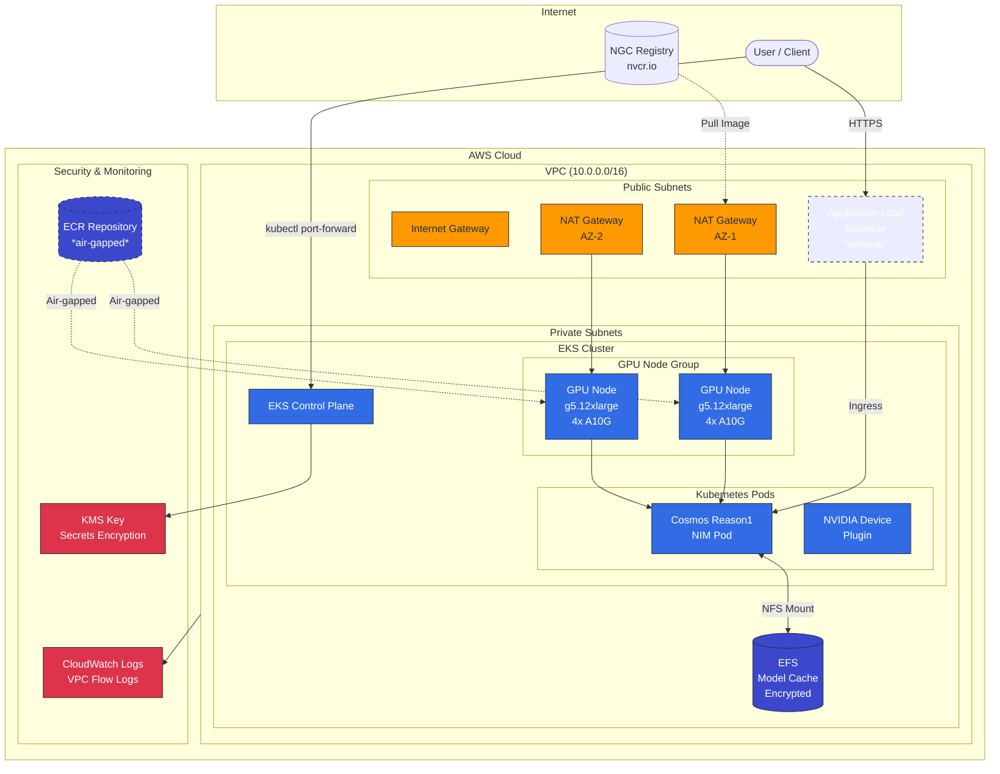

# Deploy Cosmos Reason1 on AWS for Inference
>
> **Authors:**
[Jathavan Sriram](https://www.linkedin.com/in/jathavansriram/) (**NVIDIA**) •
[Abhishek Srivastav](https://www.linkedin.com/in/abhishek-srivastav-77514717/) (**AWS**)

This guide walks you through deploying NVIDIA Cosmos Reason1 on AWS for inference workflows. We cover three deployment options: managed SageMaker endpoints for production workloads, EC2 instances for development and experimentation with full control, and EKS for containerized Kubernetes-based deployments.

## Table of Contents

- [Overview](#overview)
- [General Prerequisites](#general-prerequisites)
- [Option 1: Deploy with AWS SageMaker](#option-1-deploy-with-aws-sagemaker)
- [Option 2: Deploy on AWS EC2](#option-2-deploy-on-aws-ec2)
- [Option 3: Deploy on AWS EKS](#option-3-deploy-on-aws-eks)
- [Troubleshooting](#troubleshooting)
- [Additional Resources](#additional-resources)
- [Support](#support)

---

## Overview

[NVIDIA Cosmos Reason1](https://github.com/nvidia-cosmos/cosmos-reason1) is a multimodal reasoning model optimized for physical AI applications. This guide provides three deployment options on AWS, each suited to different use cases:

| Option | Best For | Key Benefits |
|--------|----------|--------------|
| **SageMaker** | Production workloads | Fully managed, auto-scaling, built-in monitoring |
| **EC2** | Development & experimentation | Full control, custom configurations, secure Session Manager access |
| **EKS** | Container orchestration | Kubernetes-native, scalable, EFS model caching, Helm-based deployment |

Choose the option that best fits your infrastructure requirements and operational preferences.

## General Prerequisites

- An [AWS Account](https://aws.amazon.com/) with appropriate permissions
- GPU instance quota of at least 1 instance (request via [Service Quotas](https://console.aws.amazon.com/servicequotas/)): `ml.g5.12xlarge` for SageMaker, `g5.12xlarge` for EC2/EKS
- AWS CLI installed and configured with credentials ([installation guide](https://docs.aws.amazon.com/cli/latest/userguide/getting-started-install.html))
- [Terraform](https://www.terraform.io/downloads) >= 1.0.0 installed
- Python 3.8+ with dependencies:

Install the below requirements in a Python virtual environment. These dependencies are used for testing the deployed endpoints later.

```bash
# Navigate to the cookbook directory
cd docs/getting_started/aws/reason1

# Create and activate a virtual environment
python3 -m venv venv
source venv/bin/activate

# Install dependencies for endpoint testing
pip install -r examples/requirements.txt
```

## Option 1: Deploy with AWS SageMaker

Deploy Cosmos Reason1 as a SageMaker endpoint using Terraform for reproducible, version-controlled infrastructure. This approach is ideal for teams and production environments that want managed ML infrastructure with infrastructure-as-code best practices.

### Step 1: Subscribe to the Model on AWS Marketplace

Subscribe to the Cosmos Reason1-7B model on AWS Marketplace to access the NIM container and retrieve the Model Package Name. This step is a prerequisite for the Terraform configuration and must be completed manually once.

1. Login to your AWS Account
2. Go to [NVIDIA Cosmos Reason-1-7B](https://aws.amazon.com/marketplace/pp/prodview-e6loqk6jyzssy)
3. Click **View purchase options**
4. View the **Subscribe to NVIDIA Cosmos Reason-1-7B** page and scroll down
5. Click **Subscribe**
6. Wait for the subscription process to finish
7. You should see a green bar on top of the page

    

8. Click **Launch your software** to retrieve the model package name (ARN)
9. Select your region and copy the **Model Package Name** at the end of the ARN after `...model-package/`:

    

You do not need to continue the wizard at this point, as the rest will be deployed in the following steps.

### Step 2: Verify AWS CLI Credentials

Before proceeding, verify that your AWS CLI credentials are configured correctly:

```bash
aws sts get-caller-identity
```

You should see output similar to:

```json
{
    "UserId": "AIDAEXAMPLEUSERID",
    "Account": "123456789012",
    "Arn": "arn:aws:iam::123456789012:user/your-username"
}
```

If you receive an error, configure your credentials using `aws configure` or set the appropriate environment variables.

### Step 3: Configure Terraform

Configure your Terraform environment by navigating to the project directory and setting up your configuration variables. You will define key deployment parameters such as the AWS region, model package name(from previous step), and instance type in the `terraform.tfvars` file.

```bash
# Navigate to the Terraform directory
cd docs/getting_started/aws/reason1/iac/tf/sagemaker

# Copy the example variables file
cp terraform.tfvars.example terraform.tfvars
```

Edit `terraform.tfvars` with your values:

```hcl
aws_region      = "us-east-1"
nim_package     = "your-model-package-name"  # From Step 1
resource_prefix = "cosmos"
instance_type   = "ml.g5.12xlarge"
```

### Step 4: Deploy the Infrastructure

This step runs Terraform commands to provision the AWS infrastructure needed for Reason1, including the IAM role, the SageMaker model, and the live endpoint. You will initialize the Terraform project, review the planned changes, and apply the configuration to deploy the resources.

```bash
# Ensure you're in the Terraform directory
cd docs/getting_started/aws/reason1/iac/tf/sagemaker

# Initialize Terraform
terraform init
```

??? example "Example output: `terraform init`"

    ```
    Initializing the backend...
    Initializing provider plugins...
    - Finding hashicorp/aws versions matching ">= 5.0.0"...
    - Installing hashicorp/aws v6.26.0...
    - Installed hashicorp/aws v6.26.0 (signed by HashiCorp)
    Terraform has created a lock file .terraform.lock.hcl to record the provider
    selections it made above. Include this file in your version control repository
    so that Terraform can guarantee to make the same selections by default when
    you run "terraform init" in the future.

    Terraform has been successfully initialized!

    You may now begin working with Terraform. Try running "terraform plan" to see
    any changes that are required for your infrastructure. All Terraform commands
    should now work.

    If you ever set or change modules or backend configuration for Terraform,
    rerun this command to reinitialize your working directory. If you forget, other
    commands will detect it and remind you to do so if necessary.
    ```

```bash
# Preview the deployment
terraform plan -out plan.out

# Deploy (creates IAM role, SageMaker model, endpoint config, and endpoint)
terraform apply plan.out
```

Deployment typically takes **10–15 minutes** as the NIM container loads the model.

??? example "Example output: `terraform apply plan.out`"

    ```
    aws_sagemaker_endpoint.cosmos_reason1: Still creating... [12m01s elapsed]
    aws_sagemaker_endpoint.cosmos_reason1: Still creating... [12m11s elapsed]
    aws_sagemaker_endpoint.cosmos_reason1: Still creating... [12m21s elapsed]
    aws_sagemaker_endpoint.cosmos_reason1: Creation complete after 12m22s [id=cosmos-cosmos-reason1-endpoint]

    Apply complete! Resources: 6 added, 0 changed, 0 destroyed.

    Outputs:

    endpoint_arn = "arn:aws:sagemaker:us-east-1:851725331219:endpoint/cosmos-cosmos-reason1-endpoint"
    endpoint_name = "cosmos-cosmos-reason1-endpoint"
    example_script_command = <<EOT
    # Run all examples:
    python ../../examples/reason1_example.py \
    --region us-east-1 \
    --endpoint-name cosmos-cosmos-reason1-endpoint

    # Run specific example (health, basic, streaming, reasoning, multimodal):
    python ../../examples/reason1_example.py \
    --region us-east-1 \
    --endpoint-name cosmos-cosmos-reason1-endpoint \
    --test streaming

    EOT
    execution_role_arn = "arn:aws:iam::851725331219:role/cosmos-sagemaker-execution-role"
    instance_type = "ml.g5.12xlarge"
    model_name = "cosmos-cosmos-reason1"
    region = "us-east-1"
    ```

In the output you will find the used region e.g. `us-east-1` and the endpoint_name e.g. `cosmos-cosmos-reason1-endpoint`. These will be needed in the next steps to test the created endpoint.

### Step 5: Test the Endpoint

After deployment, use the provided example script to verify the endpoint is working:

```bash
# Run all examples (health check, text, streaming, reasoning, multimodal)
cd ../../../examples/
python reason1_example.py \
  --region yourregion \
  --endpoint-name yourendpointname
```

??? example "Example call:"

    ```
    python3 reason1_example.py --region us-east-1 --endpoint-name cosmos-cosmos-reason1-endpoint
    ```

You can also run specific test examples:

```bash
# Health check only
python reason1_example.py \
  --region yourregion \
  --endpoint-name yourendpointname
  --test health

# Streaming inference (recommended for reasoning models)
python reason1_example.py \
  --region yourregion \
  --endpoint-name yourendpointname
  --test streaming

# Multimodal inference with the provided NASA image
python reason1_example.py \
  --region yourregion \
  --endpoint-name yourendpointname \
  --image ./NASA_SSPF_factory_panorama.jpg
```

??? example "Example output with the provided NASA Image"

    ```bash
    python reason1_example.py --region us-east-1 --endpoint-name cosmos-cosmos-reason1-endpoint --image ./NASA_SSPF_factory_panorama.jpg
    ```

    ============================================================
    COSMOS REASON1 ENDPOINT EXAMPLES
    ============================================================
    Region: us-east-1
    Endpoint: cosmos-cosmos-reason1-endpoint
    Example: all

    ============================================================
    TEST 0: Endpoint Health Check
    ============================================================

    [OK] Endpoint Name: cosmos-cosmos-reason1-endpoint
    [OK] Endpoint Status: InService
    [OK] Endpoint ARN: arn:aws:sagemaker:us-east-1:851725331219:endpoint/cosmos-cosmos-reason1-endpoint

    [PASSED] TEST 0: Endpoint is healthy and in service

    ============================================================
    TEST 1: Basic Text Inference (Non-Streaming)
    ============================================================

    [OK] Response received in 2.27s

    Response:
    {
    "id": "chatcmpl-28ccb39d-dadf-433f-98b6-6e076c8d696b",
    "object": "chat.completion",
    "created": 1765928373,
    "model": "nvidia/cosmos-reason1-7b",
    "choices": [
        {
        "index": 0,
        "message": {
            "role": "assistant",
            "reasoning_content": null,
            "content": "A robot is a machine designed to carry out tasks that are typically performed by humans. They can be mechanical, electronic, or a combination of both, and are often programmed to perform specific functions autonomously or with minimal human intervention. Robots vary in size, from tiny micro-robots to large industrial robots, and are used in a wide range of applications, including manufacturing, healthcare, service industries, and research.",
            "tool_calls": []
        },
        "logprobs": null,
        "finish_reason": "stop",
        "stop_reason": null
        }
    ],
    "usage": {
        "prompt_tokens": 32,
        "total_tokens": 115,
        "completion_tokens": 83,
        "prompt_tokens_details": null
    },
    "prompt_logprobs": null,
    "kv_transfer_params": null
    }

    Model Output:
    A robot is a machine designed to carry out tasks that are typically performed by humans. They can be mechanical, electronic, or a combination of both, and are often programmed to perform specific functions autonomously or with minimal human intervention. Robots vary in size, from tiny micro-robots to large industrial robots, and are used in a wide range of applications, including manufacturing, healthcare, service industries, and research.

    [PASSED] TEST 1: Basic text inference working

    ============================================================
    TEST 2: Streaming Inference
    ============================================================

    Streaming response:

    ----------------------------------------
    1. One: The first natural number, representing quantity or order.
    2. Two: A pair, symbolizing duality or balance.
    3. Three: Signifies harmony, creativity, and intuition.
    4. Four: Represents stability, structure, and harmony.
    5. Five: Symbolizes freedom, change, and adventure.
    ----------------------------------------

    [OK] Streaming completed in 1.44s
    [OK] Total tokens received: ~39

    [PASSED] TEST 2: Streaming inference working

    ============================================================
    TEST 3: Reasoning Mode (Chain-of-Thought)
    ============================================================

    Reasoning response:

    ----------------------------------------
    <think>
    Okay, let's see. The question is about what physical considerations a robot must account for when picking up a cup from a table. Hmm. First, I need to think about the robot's design and the video.

    So, the robot has to grasp the cup without dropping it. That means it needs a secure grip. Maybe the gripper has to be adjustable in size or shape to fit the cup's dimensions. The cup could be made of different materials, like ceramic or plastic, so the gripper might need to have different textures or materials that can handle the surface without slipping.

    Then, the robot has to position itself correctly. The cup is on a table, so the robot's arm or mechanical arm needs to approach from the right angle and height. The movement should be smooth to avoid shaking the cup, which might cause spills or breakage. Also, the robot has to have precise control over the movement to ensure it can pick up the cup without colliding with other objects on the table.

    Another thing is the weight of the cup. If the cup is heavy, the robot needs to have enough torque or strength in its joints to lift it without overexerting and causing structural failure. Maybe the gripper has sensors to measure the weight in real-time and adjust accordingly.

    Also, considering the video, there might be vibrations or other disturbances. The robot needs to be stable, maybe with a base that has good balance and can handle minor disturbances. The gripper's design should account for the possibility of slippage, so maybe it uses suction cups or a strong magnet, but those depend on the cup's material.

    Additionally, the robot should have a safety mechanism, like a failsafe to release the cup if it detects an error in the grasp or if it can't lift it properly. The cup's center of gravity is important too; if the cup is top-heavy, the robot has to adjust its grip position.

    Wait, also, the surface of the table matters. If the table is slippery, the robot might need to use a different approach or apply more pressure to the gripper. The color of the cup might not matter, but the material does. For example, a plastic cup might be more flexible, requiring a different grip than a glass cup.

    So putting it all together, the robot needs to consider the cup's size, shape, material, weight, the gripper's adaptability, precise positioning, strength, balance, safety mechanisms


    ----------------------------------------

    [OK] Reasoning completed in 10.29s
    [OK] Contains <think> block: True
    [OK] Contains <answer> block: False

    [PASSED] TEST 3: Reasoning mode working

    ============================================================
    TEST 4: Multimodal Inference (Image + Text)
    ============================================================
    [OK] Loaded image from: ./NASA_SSPF_factory_panorama.jpg

    Multimodal response:

    ----------------------------------------
    <think>
    Okay, let's break down the user's query. They want a detailed description of the image provided. The scene is set in a large, well-lit industrial or aerospace facility with white walls and a high ceiling. There's a prominent American flag on the wall, so it's likely a U.S. government or contractor facility. The main focus is on two large metallic structures that look like parts of a spacecraft or rocket components. These structures have intricate details and are supported by scaffolding and metal frameworks. Workers in blue lab coats and hairnets are scattered around, some operating machinery, others inspecting or assembling parts. The floor is clean and marked with safety lines. Equipment includes tool carts, computer stations, and various tools. There are also smaller machinery and storage units nearby. The overall atmosphere is one of structured activity and technical precision. The user wants a natural language description without any code, so I'll need to focus on capturing all these elements clearly and concisely.
    </think>

    <answer>
    The image depicts a bustling industrial or aerospace facility characterized by a clean, well-lit environment with white walls and a high ceiling. A large American flag is prominently displayed on one wall, emphasizing a sense of national purpose or ownership. The focal point of the scene is the assembly or maintenance of two massive metallic structures resembling spacecraft or rocket components. These structures are elevated and supported by scaffolding and complex metal frameworks, indicating advanced engineering work.

    Workers in blue lab coats, hair

    ----------------------------------------

    [OK] Multimodal inference completed in 44.61s

    [PASSED] TEST 4: Multimodal inference working

    ============================================================
    SUMMARY
    ============================================================
    HEALTH: [PASSED]
    BASIC: [PASSED]
    STREAMING: [PASSED]
    REASONING: [PASSED]
    MULTIMODAL: [PASSED]

    Total: 5/5 examples passed


    [OK] Multimodal inference completed in 44.61s

    [PASSED] TEST 4: Multimodal inference working

    ============================================================
    SUMMARY
    ============================================================
    HEALTH: [PASSED]
    BASIC: [PASSED]
    STREAMING: [PASSED]
    REASONING: [PASSED]
    MULTIMODAL: [PASSED]

    Total: 5/5 examples passed

    All examples passed!

    ```

### Step 6: Clean Up

To destroy all resources and stop charges:

```bash
cd docs/getting_started/aws/reason1/iac/tf/sagemaker
terraform destroy
```

Confirm the destruction with a `yes`.

See the full [Terraform README](./iac/tf/sagemaker/README.md) for detailed documentation.

In this part of the guide, you deployed NVIDIA Cosmos Reason1-7B on AWS SageMaker, enabling scalable real-time inference using infrastructure-as-code with Terraform. You provisioned all required cloud resources, tested the endpoint using both CLI and programmatic clients, and verified the model's health and outputs. Cleanup instructions were also provided to help you manage ongoing costs. With this workflow, you now have a robust starting point for integrating Cosmos Reason1 capabilities into your own AWS-powered AI solutions.

---

## Option 2: Deploy on AWS EC2

Deploy Cosmos Reason1 on a single AWS EC2 GPU instance using Terraform and Ansible for reproducible, secure infrastructure. This approach is ideal for development, experimentation, or workloads requiring full control over the environment. Access is via AWS Systems Manager Session Manager—no SSH keys or open ports required.

### EC2-Specific Prerequisites

In addition to the [General Prerequisites](#general-prerequisites), you'll need:

- [Session Manager Plugin](https://docs.aws.amazon.com/systems-manager/latest/userguide/session-manager-working-with-install-plugin.html) for AWS CLI
- [Ansible](https://docs.ansible.com/ansible/latest/installation_guide/intro_installation.html) >= 2.9 with boto3
- An NGC API Key for pulling NVIDIA containers (see below)

#### Generate an NGC API Key

An NGC API key is required to access NGC resources and pull the Cosmos NIM container. Generate your key at [NGC Personal Keys](https://org.ngc.nvidia.com/setup/personal-keys). For more details, refer to the [NVIDIA Cosmos NIM Quickstart Guide](https://docs.nvidia.com/nim/cosmos/latest/quickstart-guide.html#from-ngc).

Install the Session Manager plugin:

```bash
# macOS
brew install --cask session-manager-plugin

# Linux (Debian/Ubuntu)
curl "https://s3.amazonaws.com/session-manager-downloads/plugin/latest/ubuntu_64bit/session-manager-plugin.deb" -o "session-manager-plugin.deb"
sudo dpkg -i session-manager-plugin.deb

# Verify installation
session-manager-plugin --version
```

Install Ansible and dependencies:

```bash
pip install ansible boto3 botocore
```

### Step 1: Verify AWS CLI Credentials

Before proceeding, verify that your AWS CLI credentials are configured correctly:

```bash
aws sts get-caller-identity
```

You should see output similar to:

```json
{
    "UserId": "AIDAEXAMPLEUSERID",
    "Account": "123456789012",
    "Arn": "arn:aws:iam::123456789012:user/your-username"
}
```

If you receive an error, configure your credentials using `aws configure` or set the appropriate environment variables.

### Step 2: Configure Terraform

Configure your Terraform environment by navigating to the project directory and setting up your configuration variables:

```bash
# Navigate to the Terraform directory
cd docs/getting_started/aws/reason1/iac/tf/ec2

# Copy the example variables file
cp terraform.tfvars.example terraform.tfvars
```

Edit `terraform.tfvars` with your values:

```hcl
aws_region      = "us-east-1"
resource_prefix = "cosmos"
instance_type   = "g5.12xlarge"

# Optional: Set availability zones for your region
availability_zones = ["us-east-1a", "us-east-1b", "us-east-1c"]

# Optional: Create VPC endpoints if using private subnets
create_vpc_endpoints = false
```

### Step 3: Deploy the Infrastructure

This step runs Terraform commands to provision the AWS infrastructure, including the EC2 GPU instance, IAM role with Session Manager permissions, and security group. Unlike SSH-based access, no ports are opened—all access is through AWS Systems Manager.

```bash
# Ensure you're in the Terraform directory
cd docs/getting_started/aws/reason1/iac/tf/ec2

# Initialize Terraform
terraform init
```

??? example "Example output: `terraform init`"

    ```
    Initializing the backend...
    Initializing provider plugins...
    - Finding hashicorp/aws versions matching ">= 5.0.0"...
    - Installing hashicorp/aws v5.82.0...
    - Installed hashicorp/aws v5.82.0 (signed by HashiCorp)
    Terraform has created a lock file .terraform.lock.hcl to record the provider
    selections it made above.

    Terraform has been successfully initialized!
    ```

```bash
# Preview the deployment
terraform plan -out plan.out

# Deploy (creates EC2 instance, IAM role, security group)
terraform apply plan.out
```

Deployment typically takes **2–3 minutes** to provision the infrastructure.

??? example "Example output: `terraform apply plan.out`"

    ```
    aws_iam_role.ec2_role: Creating...
    aws_security_group.cosmos: Creating...
    aws_iam_role.ec2_role: Creation complete after 1s
    aws_iam_role_policy_attachment.ssm_managed_instance: Creating...
    aws_iam_role_policy_attachment.cloudwatch_agent: Creating...
    aws_iam_role_policy.s3_access: Creating...
    aws_security_group.cosmos: Creation complete after 2s
    aws_iam_instance_profile.cosmos: Creating...
    aws_iam_instance_profile.cosmos: Creation complete after 1s
    aws_instance.cosmos: Creating...
    aws_instance.cosmos: Still creating... [10s elapsed]
    aws_instance.cosmos: Creation complete after 13s [id=i-0abc123def456789]

    Apply complete! Resources: 8 added, 0 changed, 0 destroyed.

    Outputs:

    instance_id = "i-0abc123def456789"
    instance_private_ip = "172.31.42.123"
    region = "us-east-1"
    ssm_start_session_command = "aws ssm start-session --target i-0abc123def456789 --region us-east-1"
    ```

Note the `instance_id` and `ssm_start_session_command` from the output—you'll need these in the next steps.

### Step 4: Configure Software with Ansible

All software configuration (Docker, NVIDIA Container Toolkit, NGC authentication, NIM container) is handled by Ansible. This provides better error handling, idempotency, and is easier to debug than cloud-init scripts.

#### Export Your NGC API Key

Set your NGC API key as an environment variable. The simplest method is to export it directly:

```bash
export NGC_API_KEY="your-ngc-api-key"
```

#### Run Ansible Configuration

```bash
# Get instance ID, region, and S3 bucket from Terraform output
INSTANCE_ID=$(terraform output -raw instance_id)
REGION=$(terraform output -raw region)
BUCKET=$(terraform output -raw ansible_s3_bucket)

# Navigate to the Ansible directory
cd ansible

# Update the inventory with your instance ID, region, and bucket
sed -i "s/INSTANCE_ID_PLACEHOLDER/$INSTANCE_ID/" inventory_ssm.yml
sed -i "s/REGION_PLACEHOLDER/$REGION/" inventory_ssm.yml
sed -i "s/BUCKET_PLACEHOLDER/$BUCKET/" inventory_ssm.yml
```

Wait for the instance to be ready (SSM agent needs ~1-2 minutes to register):

```bash
# Check if SSM agent is registered
aws ssm describe-instance-information \
  --filters "Key=InstanceIds,Values=$INSTANCE_ID" \
  --query "InstanceInformationList[0].PingStatus" \
  --region $REGION

# Wait until it shows "Online" (usually 1-2 minutes after instance launch)
```

Run the Ansible playbook:

```bash
# Run the playbook (takes ~10-15 minutes)
ansible-playbook -i inventory_ssm.yml setup_cosmos_nim.yml
```

??? example "Example output: Ansible playbook phases"

    The playbook runs through 10 phases:

    ```
    TASK [PHASE 1: System Prerequisites] *******************************************
    ok: [cosmos_gpu] => {"msg": "Starting system prerequisites installation..."}

    TASK [PHASE 2: Verify NVIDIA GPU and Drivers] **********************************
    ok: [cosmos_gpu] => {"msg": "Verifying NVIDIA GPU and drivers..."}

    TASK [Display GPU details] *****************************************************
    ok: [cosmos_gpu] => {"msg": "GPU(s) detected: NVIDIA A10G, 24576 MiB"}

    TASK [PHASE 3: Docker Installation] ********************************************
    ok: [cosmos_gpu] => {"msg": "Installing and configuring Docker..."}

    TASK [PHASE 4: NVIDIA Container Toolkit Installation] **************************
    ok: [cosmos_gpu] => {"msg": "Installing NVIDIA Container Toolkit..."}

    TASK [PHASE 5: Verify Docker GPU Access] ***************************************
    ok: [cosmos_gpu] => {"msg": "Verifying Docker can access GPU..."}

    TASK [PHASE 6: NGC Authentication] *********************************************
    ok: [cosmos_gpu] => {"msg": "Setting up NGC authentication..."}

    TASK [PHASE 7: Setup Workspace] ************************************************
    ok: [cosmos_gpu] => {"msg": "Creating workspace directory..."}

    TASK [PHASE 8: Pull Cosmos Reason1 NIM Container] ******************************
    ok: [cosmos_gpu] => {"msg": "Pulling NIM container image (this may take several minutes)..."}

    TASK [PHASE 9: Create Helper Scripts] ******************************************
    ok: [cosmos_gpu] => {"msg": "Creating helper scripts..."}

    TASK [PHASE 10: Setup Complete] ************************************************
    ok: [cosmos_gpu] => {"msg": "\n============================================================\nCOSMOS REASON1 NIM SETUP COMPLETE\n============================================================\n..."}

    PLAY RECAP *********************************************************************
    cosmos_gpu : ok=35   changed=12   unreachable=0    failed=0    skipped=3
    ```

### Step 5: Start the NIM and Test

Connect to the instance via Session Manager and start the NIM:

```bash
# Connect to the instance (from the ec2 terraform directory)
cd ..
aws ssm start-session --target $(terraform output -raw instance_id) --region $(terraform output -raw region)
```

Inside the Session Manager session:

```bash
# Switch to ubuntu user
sudo su - ubuntu

# Navigate to workspace
cd ~/cosmos-nim

# Start the NIM (takes 2-10 minutes to load model)
./start_nim.sh
```

??? example "Example output: `./start_nim.sh`"

    ```
    Starting Cosmos Reason1 NIM...
    Container started. Waiting for NIM to be ready...
    This may take 2-10 minutes depending on GPU type.

    ............................................................
    ✓ NIM is ready!
      API endpoint: http://localhost:8000
    ```

Test the NIM API:

```bash
# Run the test script
./test_nim.sh
```

??? example "Example output: `./test_nim.sh`"

    ```
    ============================================
    Testing Cosmos Reason1 NIM API
    ============================================

    1. Health Check:
       ✓ NIM is ready

    2. Available Models:
       nvidia/cosmos-reason1-7b

    3. Text Inference Test:
       Question: What is a robot? Answer briefly.
       Response:
       A robot is a machine designed to perform tasks autonomously or semi-autonomously, often mimicking human actions.

    ============================================
    Test complete!
    ============================================
    ```

### Step 6: Access the API from Your Local Machine

Use SSM port forwarding to securely access the NIM API from your local machine.

> **⚠️ Open a New Terminal**
>
> Keep your SSM session from Step 5 running (where the NIM is active). Open a **separate terminal window** on your local machine for the port forwarding command below.

In your **new local terminal**, start port forwarding:

```bash
# Navigate to the Terraform directory
cd docs/getting_started/aws/reason1/iac/tf/ec2

# Get instance details
INSTANCE_ID=$(terraform output -raw instance_id)
REGION=$(terraform output -raw region)

# Start port forwarding (keep this terminal open)
aws ssm start-session \
  --target $INSTANCE_ID \
  --region $REGION \
  --document-name AWS-StartPortForwardingSession \
  --parameters '{"portNumber":["8000"],"localPortNumber":["8000"]}'
```

In a **third terminal** (or the same one after backgrounding the port forward), you can access the API via `localhost:8000`:

```bash
# Health check
curl http://localhost:8000/v1/health/ready

# Text inference
curl -X POST http://localhost:8000/v1/chat/completions \
  -H "Content-Type: application/json" \
  -d '{
    "model": "nvidia/cosmos-reason1-7b",
    "messages": [
      {"role": "user", "content": "What is a robot?"}
    ],
    "max_tokens": 150,
    "temperature": 0.6
  }'
```

Run the example script:

```bash
# Navigate to the examples directory
cd ../../../examples/

# Run all tests against the local port-forwarded endpoint
python reason1_example.py --host localhost --port 8000

# Or run a specific test
python reason1_example.py --host localhost --port 8000 --test basic

# Multimodal inference with the provided NASA image
python reason1_example.py --host localhost --port 8000 --image ./NASA_SSPF_factory_panorama.jpg
```

??? example "Example output with multimodal inference"

    ```bash
    python reason1_example.py --host localhost --port 8000 --image ./NASA_SSPF_factory_panorama.jpg
    ```

    ```
    ============================================================
    COSMOS REASON1 NIM ON EC2 - EXAMPLES
    ============================================================
    Endpoint: http://localhost:8000
    Test: all

    ============================================================
    HEALTH CHECK
    ============================================================
    [OK] NIM is ready at http://localhost:8000

    ============================================================
    TEST 1: Basic Text Inference
    ============================================================
    [OK] Response received in 2.15s

    Model Output:
    A robot is a machine designed to carry out tasks autonomously or with minimal
    human intervention, often mimicking human actions or capabilities.

    [PASSED] TEST 1: Basic text inference working

    ============================================================
    TEST 2: Streaming Inference
    ============================================================
    Streaming response:
    ----------------------------------------
    1. One: The foundation of counting, representing unity.
    2. Two: A pair, symbolizing balance and partnership.
    3. Three: Represents creativity and the triangle of stability.
    4. Four: Signifies structure, like the four corners of a square.
    5. Five: The midpoint, representing change and adventure.
    ----------------------------------------
    [OK] Streaming completed in 1.89s

    [PASSED] TEST 2: Streaming inference working

    ============================================================
    TEST 3: Reasoning Mode (Chain-of-Thought)
    ============================================================
    Reasoning response:
    ----------------------------------------
    <think>
    The robot needs to consider several physical factors when picking up a cup:
    grip strength, cup material, weight distribution, approach angle...
    </think>

    <answer>
    When picking up a cup, a robot must account for: grip force calibration,
    surface friction, object weight and center of mass, approach trajectory,
    and collision avoidance with surrounding objects.
    </answer>
    ----------------------------------------
    [OK] Contains <think> block: True
    [OK] Contains <answer> block: True

    [PASSED] TEST 3: Reasoning mode working

    ============================================================
    TEST 4: Multimodal Inference (Image + Text)
    ============================================================
    [OK] Loaded image from: ./NASA_SSPF_factory_panorama.jpg

    Multimodal response:
    ----------------------------------------
    <think>
    Analyzing the image, I see a large industrial facility with spacecraft
    components, workers in cleanroom attire, and an American flag...
    </think>

    <answer>
    The image shows NASA's Space Station Processing Facility with spacecraft
    components being assembled by technicians in a clean room environment.
    </answer>
    ----------------------------------------
    [OK] Multimodal inference completed in 38.45s

    [PASSED] TEST 4: Multimodal inference working

    ============================================================
    SUMMARY
    ============================================================
      HEALTH: [PASSED]
      BASIC: [PASSED]
      STREAMING: [PASSED]
      REASONING: [PASSED]
      MULTIMODAL: [PASSED]

      Total: 5/5 tests passed

    All tests passed!
    ```

### Step 7: Clean Up

To destroy all resources and stop charges:

```bash
# Navigate to the Terraform directory
cd docs/getting_started/aws/reason1/iac/tf/ec2

# Destroy all resources
terraform destroy
```

Confirm the destruction with a `yes`.

See the full [Terraform README](./iac/tf/ec2/README.md) for detailed documentation on advanced configuration options.

In this part of the guide, you deployed NVIDIA Cosmos Reason1-7B on an AWS EC2 GPU instance using infrastructure-as-code with Terraform and configuration management with Ansible. You accessed the instance securely via AWS Systems Manager Session Manager without opening any ports, configured the full software stack including Docker and NVIDIA Container Toolkit, and tested the NIM API using both the helper scripts and programmatic clients. This approach provides full control over the environment while maintaining security best practices.

---

## Option 3: Deploy on AWS EKS

Deploy Cosmos Reason1 on Amazon Elastic Kubernetes Service (EKS) using Terraform and Helm for a scalable, Kubernetes-native deployment. This approach is ideal for teams already using Kubernetes, microservices architectures, or workloads requiring container orchestration features.

### Architecture Overview



**Key Components:**

| Component | Purpose |
|-----------|---------|
| **EKS Control Plane** | Managed Kubernetes API server |
| **GPU Node Group** | Managed nodes with NVIDIA A10G/A100 GPUs |
| **NVIDIA Device Plugin** | Exposes GPUs to Kubernetes scheduler |
| **EFS** | Shared storage for model checkpoint caching |
| **NAT Gateway** | Outbound internet for NGC image pulls |
| **ALB** | Optional external access with IP restrictions |
| **ECR** | Optional private registry for air-gapped deployments |
| **KMS** | Encryption for secrets, EFS, and ECR |

### EKS-Specific Prerequisites

In addition to the [General Prerequisites](#general-prerequisites), you'll need:

- [kubectl](https://kubernetes.io/docs/tasks/tools/) for Kubernetes cluster management
- [Helm](https://helm.sh/docs/intro/install/) >= 3.0 for chart deployment
- An [NGC API Key](https://org.ngc.nvidia.com/setup/personal-keys) for pulling NVIDIA containers

Install kubectl:

```bash
# macOS
brew install kubectl

# Linux
curl -LO "https://dl.k8s.io/release/$(curl -L -s https://dl.k8s.io/release/stable.txt)/bin/linux/amd64/kubectl"
chmod +x kubectl && sudo mv kubectl /usr/local/bin/
```

Install Helm:

```bash
# macOS
brew install helm

# Linux
curl https://raw.githubusercontent.com/helm/helm/main/scripts/get-helm-3 | bash
```

### Step 1: Configure Terraform

Navigate to the EKS Terraform directory and configure your variables:

```bash
# Navigate to the Terraform directory
cd docs/getting_started/aws/reason1/iac/tf/eks

# Copy the example variables file
cp terraform.tfvars.example terraform.tfvars
```

Edit `terraform.tfvars` with your values:

```hcl
aws_region      = "us-east-1"
resource_prefix = "cosmos"

# Kubernetes version
kubernetes_version = "1.31"

# GPU node configuration
gpu_instance_type  = "g5.12xlarge"
gpu_node_count     = 1
gpu_node_min_count = 1
gpu_node_max_count = 3

# Enable optional features
enable_cluster_autoscaler          = true
enable_metrics_server              = true
enable_aws_load_balancer_controller = true
```

### Step 2: Deploy the EKS Cluster

Deploy the infrastructure using Terraform:

```bash
# Initialize Terraform
terraform init

# Review the plan
terraform plan

# Deploy (takes 15-20 minutes)
terraform apply
```

??? example "Example output: `terraform apply`"

    ```
    Apply complete! Resources: 55 added, 0 changed, 0 destroyed.

    Outputs:

    cluster_name = "cosmos-eks"
    cluster_endpoint = "https://XXXXXXXX.gr7.us-east-1.eks.amazonaws.com"
    configure_kubectl = "aws eks update-kubeconfig --name cosmos-eks --region us-east-1"
    cosmos_namespace = "cosmos"
    efs_file_system_id = "fs-0123456789abcdef0"
    model_cache_pvc_name = "cosmos-model-cache"
    region = "us-east-1"
    ```

The deployment includes an **EFS file system** for caching model checkpoints. This shared storage significantly reduces startup time for subsequent pods (from ~10 minutes to ~1-2 minutes).

### Step 3: Configure kubectl

Configure kubectl to access the cluster:

```bash
# Configure kubectl using Terraform output
aws eks update-kubeconfig \
  --name $(terraform output -raw cluster_name) \
  --region $(terraform output -raw region)

# Verify cluster access
kubectl get nodes
```

You should see your GPU nodes:

```
NAME                                         STATUS   ROLES    AGE   VERSION
ip-10-0-1-123.us-east-1.compute.internal    Ready    <none>   5m    v1.31.0-eks-xxxxx
```

Verify the EFS storage is ready:

```bash
kubectl get pv,pvc -n cosmos
```

You should see the model cache PV and PVC in `Bound` status:

```
NAME                                  CAPACITY   ACCESS MODES   RECLAIM POLICY   STATUS   CLAIM                       STORAGECLASS
persistentvolume/cosmos-model-cache   100Gi      RWX            Retain           Bound    cosmos/cosmos-model-cache   efs-sc

NAME                                       STATUS   VOLUME              CAPACITY   ACCESS MODES   STORAGECLASS
persistentvolumeclaim/cosmos-model-cache   Bound    cosmos-model-cache  100Gi      RWX            efs-sc
```

### Step 4: Configure NGC Secrets

Create the required secrets for pulling NVIDIA NIM containers:

```bash
# Set your NGC API key
export NGC_API_KEY="your-ngc-api-key"

# Create NGC API key secret
kubectl create secret generic ngc-api-key \
  --from-literal=NGC_API_KEY=$NGC_API_KEY \
  -n cosmos

# Create NGC registry pull secret
kubectl create secret docker-registry ngc-registry \
  --docker-server=nvcr.io \
  --docker-username='$oauthtoken' \
  --docker-password=$NGC_API_KEY \
  -n cosmos
```

### Step 5: Deploy Cosmos Reason1 with Helm

Deploy the NIM using the included Helm chart with EFS model caching:

```bash
# Deploy Cosmos Reason1 NIM with EFS cache
helm install cosmos-reason1 ./helm/cosmos-reason1 \
  --namespace cosmos \
  --set persistence.enabled=true \
  --set persistence.existingClaim=cosmos-model-cache

# Watch pod status
kubectl get pods -n cosmos -w
```

The pod will go through several stages:

- `Pending` → Waiting for GPU node scheduling
- `ContainerCreating` → Pulling container image
- `Running` → Container started, model loading
- `Ready` → NIM is ready to serve requests

**Startup times with EFS cache:**

- **First deployment**: ~5-10 minutes (downloads model to EFS)
- **Subsequent deployments**: ~1-2 minutes (loads from EFS cache)

??? example "Example output: Pod status"

    ```
    NAME                              READY   STATUS    RESTARTS   AGE
    cosmos-reason1-7b4f8c9d6-xj2km   0/1     Pending   0          5s
    cosmos-reason1-7b4f8c9d6-xj2km   0/1     ContainerCreating   0          15s
    cosmos-reason1-7b4f8c9d6-xj2km   0/1     Running   0          2m
    cosmos-reason1-7b4f8c9d6-xj2km   1/1     Running   0          8m
    ```

### Step 6: Access the NIM API

There are two options for accessing the NIM API, depending on your security requirements:

| Option | Use Case | Security Level | Internet Exposure |
|--------|----------|----------------|-------------------|
| **A: Port Forwarding** | Development, testing, single-user | High (no exposure) | None |
| **B: AWS ALB** | Team access, production | Medium (IP-restricted) | Limited by Security Group |

#### Option A: No External Exposure (kubectl port-forward)

This is the **recommended approach for development and testing**. The API is only accessible from your local machine through an encrypted tunnel—no external exposure.

**How it works:**

```
Your Machine ──(encrypted tunnel)──> EKS API ──> Pod
     :8000                                     :8000
```

Start port forwarding:

```bash
# In a terminal, start port forwarding (keeps running)
kubectl port-forward svc/cosmos-reason1 8000:8000 -n cosmos
```

In another terminal, test the API:

```bash
# Health check
curl http://localhost:8000/v1/health/ready

# List models
curl http://localhost:8000/v1/models

# Test inference
curl -X POST http://localhost:8000/v1/chat/completions \
  -H "Content-Type: application/json" \
  -d '{
    "model": "nvidia/cosmos-reason1-7b",
    "messages": [
      {"role": "user", "content": "What is a robot?"}
    ],
    "max_tokens": 150,
    "temperature": 0.6
  }'
```

Run the example script:

```bash
# Navigate to the examples directory
cd ../../../examples/

# Run tests against the port-forwarded endpoint
python reason1_example.py --host localhost --port 8000

# Test with the NASA image
python reason1_example.py --host localhost --port 8000 --image ./NASA_SSPF_factory_panorama.jpg
```

**Benefits of port forwarding:**

- ✅ No internet exposure—completely private
- ✅ No additional infrastructure cost (no ALB)
- ✅ Works immediately without DNS configuration
- ✅ Encrypted via kubectl's TLS connection

**Limitations:**

- ❌ Only one user can access at a time (per port-forward session)
- ❌ Connection drops if terminal closes
- ❌ Not suitable for team or production access

### Step 7: (Optional) Expose via AWS ALB with IP Restrictions

For team access or production deployments, expose the API via an AWS Application Load Balancer (ALB) with Security Group rules to restrict access by IP address.

**How it works:**

```
Allowed IPs ──> ALB ──(Security Group)──> EKS Nodes ──> Pod
  (CIDR)      :443                                    :8000
```

#### Step 7a: Create a values file for ALB configuration

Create a file `values-alb.yaml` with your configuration:

```yaml
# values-alb.yaml
ingress:
  enabled: true
  className: alb
  annotations:
    # ALB configuration
    alb.ingress.kubernetes.io/scheme: internet-facing
    alb.ingress.kubernetes.io/target-type: ip
    alb.ingress.kubernetes.io/healthcheck-path: /v1/health/ready
    alb.ingress.kubernetes.io/healthcheck-interval-seconds: "30"
    alb.ingress.kubernetes.io/healthcheck-timeout-seconds: "10"
    alb.ingress.kubernetes.io/healthy-threshold-count: "2"
    alb.ingress.kubernetes.io/unhealthy-threshold-count: "3"

    # Security: Restrict access by IP (REQUIRED for security)
    # Replace with your allowed CIDR blocks
    alb.ingress.kubernetes.io/inbound-cidrs: "10.0.0.0/8,192.168.1.0/24,YOUR_PUBLIC_IP/32"

    # Optional: Enable HTTPS (recommended for production)
    # alb.ingress.kubernetes.io/listen-ports: '[{"HTTPS":443}]'
    # alb.ingress.kubernetes.io/certificate-arn: arn:aws:acm:region:account:certificate/cert-id

  hosts:
    - host: ""  # Empty for ALB DNS name, or set your domain
      paths:
        - path: /
          pathType: Prefix
```

> **⚠️ Security Warning**: Always set `alb.ingress.kubernetes.io/inbound-cidrs` to restrict access. Without this, the ALB is open to the internet!

#### Step 7b: Find your public IP

```bash
# Get your current public IP
curl -s ifconfig.me
# Example output: 203.0.113.45
```

#### Step 7c: Deploy with ALB ingress

```bash
# Upgrade Helm release with ALB configuration
helm upgrade cosmos-reason1 ./helm/cosmos-reason1 \
  --namespace cosmos \
  -f values-alb.yaml
```

#### Step 7d: Get the ALB endpoint

```bash
# Wait for ALB provisioning (1-3 minutes)
kubectl get ingress -n cosmos -w

# Get the ALB DNS name
ALB_DNS=$(kubectl get ingress cosmos-reason1 -n cosmos -o jsonpath='{.status.loadBalancer.ingress[0].hostname}')
echo "ALB Endpoint: http://$ALB_DNS"
```

??? example "Example output: ALB endpoint"

    ```
    NAME             CLASS   HOSTS   ADDRESS                                                              PORTS   AGE
    cosmos-reason1   alb     *       k8s-cosmos-cosmosre-abc123-1234567890.us-east-1.elb.amazonaws.com   80      2m

    ALB Endpoint: http://k8s-cosmos-cosmosre-abc123-1234567890.us-east-1.elb.amazonaws.com
    ```

#### Step 7e: Test the ALB endpoint

```bash
# Health check via ALB
curl http://$ALB_DNS/v1/health/ready

# Test inference via ALB
curl -X POST http://$ALB_DNS/v1/chat/completions \
  -H "Content-Type: application/json" \
  -d '{
    "model": "nvidia/cosmos-reason1-7b",
    "messages": [{"role": "user", "content": "What is a robot?"}],
    "max_tokens": 150
  }'
```

#### Security Group Configuration

The ALB Security Group is automatically created by the AWS Load Balancer Controller. The `inbound-cidrs` annotation restricts inbound traffic at the ALB level.

**Common CIDR patterns:**

| Pattern | Description |
|---------|-------------|
| `YOUR_IP/32` | Single IP address (e.g., `203.0.113.45/32`) |
| `10.0.0.0/8` | Private network (RFC 1918) |
| `192.168.0.0/16` | Private network (RFC 1918) |
| `172.16.0.0/12` | Private network (RFC 1918) |
| `COMPANY_VPN_CIDR` | Your company VPN exit IPs |

**Example for team access:**

```yaml
# Allow office network + VPN + specific developer IPs
alb.ingress.kubernetes.io/inbound-cidrs: "10.0.0.0/8,203.0.113.0/24,198.51.100.45/32"
```

#### Disable ALB (revert to port-forward only)

```bash
helm upgrade cosmos-reason1 ./helm/cosmos-reason1 \
  --namespace cosmos \
  --set ingress.enabled=false
```

### Air-Gapped Deployment with ECR (Optional)

For environments without direct internet access or where NGC connectivity is restricted, you can use AWS Elastic Container Registry (ECR) to store and serve NIM images locally.

#### Step 1: Enable ECR Repository

Update your `terraform.tfvars` to create an ECR repository:

```hcl
# Enable ECR repository creation
create_ecr_repository = true
ecr_repository_name   = "cosmos-reason1"
ecr_scan_on_push      = true
```

Then apply the changes:

```bash
terraform apply
```

The output will include the ECR repository URL:

```
ecr_repository_url = "123456789012.dkr.ecr.us-east-1.amazonaws.com/cosmos-reason1"
```

#### Step 2: Push NIM Image to ECR

From a machine with both NGC access and internet connectivity (this can be done once, then the image is available in your AWS account):

```bash
# Get the ECR repository URL from Terraform output
ECR_REPO=$(terraform output -raw ecr_repository_url)
AWS_REGION=$(terraform output -raw region)

# Step 2a: Authenticate to ECR
aws ecr get-login-password --region $AWS_REGION | \
  docker login --username AWS --password-stdin $ECR_REPO

# Step 2b: Authenticate to NGC and pull the NIM image
echo $NGC_API_KEY | docker login nvcr.io -u '$oauthtoken' --password-stdin
docker pull nvcr.io/nim/nvidia/cosmos-reason1-7b:latest

# Step 2c: Tag the image for ECR
docker tag nvcr.io/nim/nvidia/cosmos-reason1-7b:latest $ECR_REPO:latest

# Step 2d: Push to ECR
docker push $ECR_REPO:latest
```

??? example "Example output: Docker push to ECR"

    ```
    The push refers to repository [123456789012.dkr.ecr.us-east-1.amazonaws.com/cosmos-reason1]
    5f70bf18a086: Pushed
    a3ed95caeb02: Pushed
    ...
    latest: digest: sha256:abc123... size: 1234
    ```

#### Step 3: Deploy Using ECR Image

Deploy the Helm chart using the ECR image instead of NGC:

```bash
# Get ECR repository URL
ECR_REPO=$(terraform output -raw ecr_repository_url)

# Deploy with ECR image (no NGC pull secret needed)
helm install cosmos-reason1 ./helm/cosmos-reason1 \
  --namespace cosmos \
  --set image.repository=$ECR_REPO \
  --set image.tag=latest \
  --set imagePullSecrets=[] \
  --set persistence.enabled=true \
  --set persistence.existingClaim=cosmos-model-cache
```

**Key differences from NGC deployment:**

| Setting | NGC (Default) | ECR (Air-Gapped) |
|---------|---------------|------------------|
| `image.repository` | `nvcr.io/nim/nvidia/cosmos-reason1-7b` | `<account>.dkr.ecr.<region>.amazonaws.com/cosmos-reason1` |
| `imagePullSecrets` | `[{name: ngc-registry}]` | `[]` (EKS nodes have ECR access via IAM) |
| NGC API Key Secret | Required | Not needed for image pull |

#### Step 4: Skip NGC Secrets (Optional)

When using ECR, you don't need the NGC registry pull secret. However, you still need the NGC API key secret for the NIM container to authenticate with NVIDIA services at runtime:

```bash
# NGC API key is still required for NIM runtime
kubectl create secret generic ngc-api-key \
  --from-literal=NGC_API_KEY=$NGC_API_KEY \
  -n cosmos
```

> **Note**: The NGC API key is used by the NIM container at runtime for license validation and telemetry. The ECR approach only replaces the container registry for image pulls.

#### Air-Gapped Benefits

- **No NGC Dependency**: Container images served from your AWS account
- **Faster Pulls**: ECR is within your AWS region, reducing pull times
- **Compliance**: Images stored in your own infrastructure for audit
- **Security Scanning**: ECR scans images for vulnerabilities on push
- **Lifecycle Policies**: Automatic cleanup of old images (keeps last 5)

### Step 8: Clean Up

To destroy all resources and stop charges:

```bash
# Remove Helm release
helm uninstall cosmos-reason1 -n cosmos

# Delete secrets
kubectl delete secret ngc-api-key ngc-registry -n cosmos

# Destroy EKS infrastructure
cd docs/getting_started/aws/reason1/iac/tf/eks
terraform destroy
```

Confirm the destruction with a `yes`.

See the full [Terraform README](./iac/tf/eks/README.md) for detailed documentation on advanced configuration options.

In this part of the guide, you deployed NVIDIA Cosmos Reason1-7B on Amazon EKS using Terraform for infrastructure provisioning and Helm for application deployment. The Kubernetes-native approach provides container orchestration, scaling capabilities, and integrates well with existing Kubernetes workflows. Key features include GPU node groups with NVIDIA device plugin, EFS for model caching (reducing startup times from ~10 minutes to ~1-2 minutes), Cluster Autoscaler for dynamic scaling, and optional ECR support for air-gapped deployments.

---

## Troubleshooting

### GPU Quota Issues

If you can't launch GPU instances:

1. Go to [Service Quotas](https://console.aws.amazon.com/servicequotas/)
2. Search for your instance type (e.g., "Running On-Demand G and VT instances")
3. Request a quota increase (allow 24–48 hours)

### Out of Memory Errors

If you encounter CUDA out of memory errors:

1. Use a larger instance type
2. Enable gradient checkpointing for post-training
3. Reduce batch size
4. Use mixed precision (fp16/bf16)

---

## Additional Resources

- [NVIDIA Cosmos Reason-1-7B on AWS Marketplace](https://aws.amazon.com/marketplace/pp/prodview-e6loqk6jyzssy)
- [Cosmos Reason-1-7B Jupyter Notebook](https://github.com/NVIDIA/nim-deploy/blob/main/cloud-service-providers/aws/sagemaker/aws_marketplace_notebooks/nim_cosmos-reason1-7b_aws_marketplace.ipynb)
- [Cosmos Reason1 GitHub Repository](https://github.com/nvidia-cosmos/cosmos-reason1)
- [Cosmos Reason1 Model on Hugging Face](https://huggingface.co/nvidia/Cosmos-Reason1-7B)
- [Cosmos Reason1 Paper](https://arxiv.org/abs/2503.15558)
- [AWS SageMaker Documentation](https://docs.aws.amazon.com/sagemaker/)
- [AWS Systems Manager Session Manager](https://docs.aws.amazon.com/systems-manager/latest/userguide/session-manager.html)
- [NVIDIA NIM Prerequisites](https://docs.nvidia.com/nim/cosmos/latest/prerequisites.html)
- [Cosmos Cookbook](https://github.com/nvidia-cosmos/cosmos-cookbook)

## Support

For issues related to:

- **Cosmos Reason1**: Open an issue on the [GitHub repository](https://github.com/nvidia-cosmos/cosmos-reason1/issues)
- **AWS Services**: Contact [AWS Support](https://aws.amazon.com/support/)
